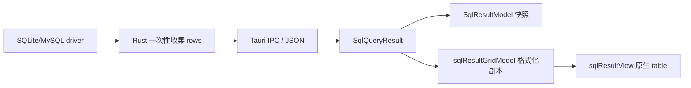

# Nyala Studio 选择性采用 Zeus UI 评估

> 评估日期：2026-08-10
>
> 评估范围：不替换现有 SideX / VS Code Workbench UI，只评估后续新功能，重点是 `@zeus-web/data-grid`。
>
> 结论级别：架构建议，不是本次生产实现方案。
>
> 路线归属：[`MVP vNext Agent + Zeus 路线`](../sql-mvp-phases/mvp-vnext-agent-zeus-roadmap.md) 的 Z0 决策输入。

## 结论先行

**建议有条件采用，不建议把 Zeus UI 设为 Nyala Studio 的通用 UI 基础。**

可以批准一个隔离的 SQL Data Grid 试点：仅在未来确实需要高密度、双轴滚动和大量列的 SQL 结果表面使用 `@zeus-web/data-grid`，通过 Nyala 自己的 SQL 适配器接入，并保留现有原生表格或 `WorkbenchTable` 作为回退。试点应在 Phase 08 的原生 Validate 验收完成后开始，且必须由 Nyala 的真实 Tauri/WebView 基准证明有收益。

当前不建议直接改造现有结果面板。原因不是 Zeus UI 没有价值，而是当前面板的主要瓶颈还包括 IPC/JSON 传输、Rust 端一次性收集结果、前端结果快照的重复内存，以及产品功能尚未需要虚拟化。只替换 DOM 渲染层，不能把这些问题变成流式大结果能力。

### 决策表

| 事项                                                                    | 建议                        | 理由                                                                                               |
| ----------------------------------------------------------------------- | --------------------------- | -------------------------------------------------------------------------------------------------- |
| Workbench shell、Activity Bar、菜单、Tree、表单、Dialog、命令和焦点系统 | 保持现有 VS Code primitives | 这些组件深度绑定 Workbench 生命周期、Context Key、Keybinding、主题和扩展宿主；替换收益小、回归面大 |
| 现有 SQL 结果面板立即迁移                                               | 暂缓                        | Phase 04 明确未承诺 virtualized grid；当前默认最多渲染 1,000 行，先满足 MVP 行为比换表格更重要     |
| 未来 SQL 高密度结果表                                                   | 有条件试点 Zeus Data Grid   | 双轴虚拟化、键盘导航、选择、排序、列宽调整与使用场景匹配                                           |
| `WorkbenchTable`                                                        | 作为零新依赖的基线和回退    | 已经接入 Workbench 主题、List、导航和选择；可先验证行虚拟化收益                                    |
| 全局采用 Zeus UI                                                        | 不采用                      | 目前证据不足，组件成熟度、依赖闭包和 Workbench 适配成本不支持全局迁移                              |
| 后端流式/分页/背压                                                      | 单独立项                    | Data Grid 接收完整 `rows` 数组，不能替代数据链路设计                                               |

## 证据边界与方法

本评估把仓库代码、路线图文档、已安装 npm 包和可重复的本地 bundle smoke test 分开记录。外部包的能力以发布包的类型声明、Custom Elements 元数据和 npm registry 元数据为准；没有把上游 README 或 benchmark 的宣传数字当成 Nyala 的性能承诺。

仓库证据的关键入口：

- [Phase 00–08 总索引](../sql-mvp-phases/README.md)：Phase 08 已于 2026-08-11 记录原生连接页 live MySQL Validate 通过，Zeus spike 的这一前置条件已满足。
- [Phase 04 结果面板设计](../sql-mvp-phases/phase-04-result-panel.md)：列排序、过滤、列宽调整、无限滚动、流式大结果和 virtualized grid 都明确不在 MVP 范围。
- [`sqlResultView.ts`](../../src/vs/workbench/contrib/sqlResult/browser/sqlResultView.ts)：当前结果面板手写 `<table>`、列头、行、单元格选择和 copy 行为。
- [`sqlResultGridModel.ts`](../../src/vs/workbench/contrib/sqlResult/common/sqlResultGridModel.ts)：对结果行做截断、格式化和 copy 所需的网格派生。
- [`sqlResultModel.ts`](../../src/vs/workbench/contrib/sqlResult/common/sqlResultModel.ts)：保存最多 20 个结果快照；成功快照同时保留结果和格式化网格。
- [`tableWidget.ts`](../../src/vs/base/browser/ui/table/tableWidget.ts) 与 [`listService.ts`](../../src/vs/platform/list/browser/listService.ts)：已有 VS Code `Table` / `WorkbenchTable` 路径。
- [`types.rs`](../../src-tauri/src/commands/sql/types.rs) 与 [`state.rs`](../../src-tauri/src/commands/sql/state.rs)：SQLite/MySQL 查询结果由后端一次性收集并序列化；默认行数 1,000，硬上限 100,000。

外部证据（截至 2026-08-10）：

- [Zeus UI 仓库](https://github.com/baicie/zeus-ui)，MIT；Nyala 与其由同一 GitHub 维护者组织，降低协调成本但也意味着维护资源集中。
- [`@zeus-web/data-grid` npm 页面](https://www.npmjs.com/package/@zeus-web/data-grid)：`0.1.0-beta.2`；`beta` tag 指向 `.2`，`latest` 仍指向 `.0`。
- [npm registry package metadata](https://registry.npmjs.org/@zeus-web%2Fdata-grid)：`.2` 于 2026-08-03 发布，发布包 unpacked size 279,075 bytes，MIT，提供 Web Component、React 和 Vue exports。
- [npm downloads API](https://api.npmjs.org/downloads/point/2026-07-11:2026-08-10/%40zeus-web%2Fdata-grid)：最近 30 天 378 次下载；[最近 7 天](https://api.npmjs.org/downloads/point/2026-08-04:2026-08-10/%40zeus-web%2Fdata-grid) 35 次。

本地安装审计目录为 `/tmp/nyala-zeus-audit-20260810`，不属于仓库。执行 `pnpm add @zeus-web/data-grid@0.1.0-beta.2` 成功，依赖树约 24 MB；用仓库的 esbuild 0.28.1、目标 `chrome100,safari15` 对 `@zeus-web/data-grid/wc/auto` 做近似 bundle，结果为 73,483 bytes、gzip -9 为 24,260 bytes。该结果不是 Nyala 最终 Vite chunk 大小，只是决策前的可重复量级检查。

## Nyala 当前数据路径

### 已有架构约束

Nyala 是 VS Code-style Workbench 加 Tauri Rust 后端。SQL 产品代码应放在 `src/vs/workbench/contrib/sql*` 与 `src/vs/workbench/services/sql*`；视图不能直接调用 Tauri `invoke`，跨层行为要经过 SQL service。引入 Zeus 时应遵守同一边界，不把 Web Component 注册或 Zeus 类型扩散到 `src/vs/base`、`src/vs/platform` 或编辑器基础设施。

### 目前结果表的实际成本

现有结果面板的路径大致如下：



这条链路有四个与组件无关的成本：

1. Rust 查询结果是整体收集和整体序列化，没有批次、分页、背压或取消后的增量消费。
2. 前端默认渲染上限是 `SQL_RESULT_MAX_RENDER_ROWS = 1_000`；产品偏好允许 50–10,000，Rust 默认 1,000、硬上限 100,000。提高显示上限会线性放大 IPC、解析和内存压力。
3. `buildSqlResultGrid` 会建立用于显示/copy 的格式化行和单元格对象；结果快照还会保留原始 `result`，历史最多 20 个快照，可能重复占用内存。
4. 原生 `<table>` 会为当前渲染范围建立每个单元格的 DOM，且现有 CSS/键盘/copy/错误/空态行为是 Nyala 自己维护的产品契约。

因此，Zeus 的双轴虚拟化主要解决第 4 项中的 DOM 数量和滚动布局成本；它不会自动解决第 1–3 项。

### 现有 `WorkbenchTable` 是合理基线

VS Code 的 `Table` 基于虚拟化 `List`，并提供选择、导航、列宽调整、主题和 Workbench 服务集成。它主要虚拟化行，单个可见行仍会创建所有列的 cell；如果 SQL 结果通常是 10–30 列，先用它做对照基准比直接引入新依赖更能回答“Zeus 的双轴虚拟化是否带来实际收益”。

## Zeus UI 可验证能力

以下能力来自 `@zeus-web/data-grid@0.1.0-beta.2` 的 Web Component 类型声明和 `dist/custom-elements.json`：

| 能力                                   | 当前证据                                                           | 对 SQL 结果的意义                                             |
| -------------------------------------- | ------------------------------------------------------------------ | ------------------------------------------------------------- |
| 双轴 row/column virtualization         | 组件描述、`row-virtualizer` / `column-virtualizer` 导出与实现      | 宽表、横向滚动和大量行时可能显著减少 DOM                      |
| active cell、键盘导航、roving tabindex | `active-cell-change`、navigation model、ARIA 元数据                | 可承接表格浏览的基础可访问性和快捷键                          |
| 单行/多行选择                          | `selection-mode` 与 `selection-change`                             | 可接 Nyala 的行 copy / 后续导出，但事件映射仍由适配器负责     |
| 客户端单列排序                         | `sort-column`、`sort-direction`、`sort-change`                     | 只能排序已加载/已截断数组，不能冒充数据库全量排序             |
| 列宽调整                               | `resizeColumn`、resize events、resize handle part                  | 可减少自写列宽交互，但要映射 Workbench 主题和持久化策略       |
| Web Component 入口                     | `@zeus-web/data-grid/wc/auto`                                      | 与 Workbench 原生 DOM 的边界清晰，不需要引入 React/Vue 应用层 |
| ARIA grid 语义                         | `role=grid` 相关元数据、active descendant 和 aria index            | 有利于键盘/屏幕阅读器，但仍需 Nyala 自己做端到端验收          |
| headless/light DOM                     | 包说明为 headless；实现 `shadow: false`，使用 `data-slot` / `part` | 可映射 VS Code token；也意味着宿主必须提供完整布局 CSS        |

### 当前缺口

发布包没有足够证据支持下列需求：

- 没有过滤、分组、tree/pivot、单元格编辑或 server-side datasource API。
- 当前公开类型没有 Nyala 所需的通用自定义 cell renderer hook，也没有现成 pinned-column 字段；NULL、BLOB、日期、错误样式必须先由 Nyala 转成展示字符串/状态。
- 组件接收完整 `rows` 数组；它可以少创建 DOM，但不会减少 Tauri IPC 或前端数组占用。
- light DOM 的 virtual layout 需要宿主设置 `overflow`、绝对定位行/body、sticky header 等 CSS；“安装后自动好看”不是事实。
- npm 仍以 beta 发布，`latest` 与 beta tag 不一致，升级和回滚策略必须由 Nyala 控制。

### 数据语义适配

Nyala 不能把原始 `SqlCellValue` 直接交给通用网格而放弃产品语义。适配器至少要负责：

| Nyala 语义               | Zeus 默认行为            | 适配要求                                                                |
| ------------------------ | ------------------------ | ----------------------------------------------------------------------- |
| `null`                   | 空值显示为空             | 预格式化为字面量 `NULL`，保留 `isNull` 元数据供主题/复制使用            |
| blob                     | 无 SQL-specific 展示规则 | 保留 Nyala 的 `BLOB(...)` 文本与 copy 规则，不打印原始敏感内容          |
| 行号                     | 没有业务 row-number 列   | 适配器合成不可排序的 `#` 列                                             |
| copy cell/row/column/all | 仅有选择/事件            | 继续走 Nyala copy service 和 CSV/TSV formatter                          |
| sort                     | 客户端已加载数组排序     | 明示“当前结果集排序”；全量排序必须重新生成 SQL/查询，不能在 UI 假装完成 |
| error/empty/running      | 不是网格本身的完整状态   | 由 `SqlResultView` 外层继续管理，网格只负责 success 数据态              |

## 选项比较

| 选项                           | 直接收益                             | 新增复杂度                                        | 主要风险                                    | 判断                              |
| ------------------------------ | ------------------------------------ | ------------------------------------------------- | ------------------------------------------- | --------------------------------- |
| 保留原生 `<table>`             | 零依赖、行为完全可控                 | 继续维护 DOM 与列交互                             | 大结果滚动和宽表体验较弱                    | 适合当前 MVP 与小结果             |
| 迁移到 `WorkbenchTable`        | 复用 VS Code 虚拟行、主题、选择      | 需把 SQL cell/copy/键盘契约接到 Table             | 无双轴虚拟化；仍需大量 SQL glue code        | 值得做基准/回退，不是必然迁移     |
| Zeus Data Grid + Nyala adapter | 双轴虚拟化、列宽、基础导航开箱可组合 | 新依赖、Web Component 生命周期、CSS/事件/语义适配 | beta 稳定性、依赖闭包、功能缺口             | 未来高密度 SQL surface 的候选试点 |
| Zeus 作为全局 UI 默认          | 统一组件品牌的潜在收益               | shell、菜单、Tree、Dialog、焦点/命令全线适配      | 破坏 Workbench 集成，回归面和长期维护成本高 | 不建议                            |

### 价值判断

价值是**局部且有条件的**：

- 当目标是 1,000 行 × 20 列以内的普通查询时，现有面板的结果状态、copy、历史和 SQL 语义更重要，Zeus 的收益可能不足以覆盖适配成本。
- 当目标是几十万行的已加载预览、数百列宽表、频繁横向/纵向滚动时，双轴虚拟化有明确的潜在价值；但必须先解决结果上限、分页/流式和内存，否则只是“少画一些已经传过来的数据”。
- Nyala 与 Zeus UI 的维护者相同，问题沟通和 API 协商成本可能较低；同时单一维护者、低下载量和 beta tag 也构成供应链与持续维护风险，不能把组织关系当成稳定性证据。

### 对后续其他 Zeus 组件的采用原则

Zeus UI 更适合作为“按能力选用的组件库”，而不是 Nyala 的第二套设计系统。不能因为 Data Grid 试点通过，就自动批准后续所有 Zeus 组件；每个组件都应独立证明它解决了现有 Workbench primitive 难以经济解决的问题。

| 组件类型                             | 默认判断                       | 典型例子                                                    | 准入理由                                                                               |
| ------------------------------------ | ------------------------------ | ----------------------------------------------------------- | -------------------------------------------------------------------------------------- |
| 叶子级、算法密集、交互复杂的业务组件 | 值得单独评估                   | 虚拟化 Data Grid、未来确有需求的复杂数据可视化              | 能力收益可测，依赖可以封装在单个 contribution 内，回退边界清楚                         |
| 普通输入与显示组件                   | 默认继续用 Workbench primitive | Button、Input、Select、Checkbox、Badge、Toolbar             | 现有组件已接入主题、焦点、Context Key 和可访问性；统一视觉的收益通常不足以覆盖双栈成本 |
| Overlay 与全局交互组件               | 高度审慎                       | Dialog、Popover、Menu、Command Palette、Notification        | 涉及焦点陷阱、层级、快捷键、窗口和生命周期，容易与 Workbench 基础设施冲突              |
| Workbench shell / extHost 相关表面   | 不采用                         | Activity Bar、Side Bar、Panel shell、Tree、Editor、Terminal | 属于 vendor-grade 架构和扩展宿主契约，替换不符合本仓库边界                             |

每个新组件的最小决策记录都应回答：

1. 现有 VS Code / SideX primitive 的具体缺口是什么，是否有真实 workload 或交互证据？
2. Zeus 的发布包是否稳定、可精确锁版，production dependency 与增量 bundle 是否可接受？
3. 能否只在一个 SQL contribution 内动态加载，并用 Nyala adapter 隔离事件、主题、数据语义和生命周期？
4. macOS WebKit 与 Windows WebView2 的焦点、键盘、缩放、高对比和窄布局是否通过？
5. 是否存在 native/Workbench fallback，升级或移除时会不会影响持久化格式和跨模块调用者？

这意味着“后续新功能优先看 Zeus”可以作为**候选发现规则**，不能成为“默认直接依赖 Zeus”的实现规则。

## 工作量估算

估算假设：1 名熟悉 VS Code Workbench、TypeScript 和 Tauri 的工程师；不改现有 Rust 查询协议；包含 macOS WebKit 与 Windows WebView2 基本 QA；范围不含新数据库驱动。数字是规划区间，不是承诺。

| 工作包                       |                      工程量 |   日历时间（通常） | 产出                                                                 |
| ---------------------------- | --------------------------: | -----------------: | -------------------------------------------------------------------- |
| 简单叶子组件单次准入         |  2–4 开发人日 + 1–2 QA 人日 |            约 1 周 | 依赖/包体审计、主题、生命周期、键盘/无障碍、fallback                 |
| 复杂 Overlay/焦点型组件准入  | 5–10 开发人日 + 2–4 QA 人日 |             1–3 周 | Workbench focus/keybinding/context menu 契约与两平台验证；通常不划算 |
| 兼容性/性能 spike            |                    3–5 人日 |             1 周内 | 最小 Web Component adapter、1k×20 与宽表/长表基准、依赖和 CSS 结论   |
| 隔离 SQL surface 试点        | 8–12 开发人日 + 3–5 QA 人日 |             2–3 周 | feature flag、success 态网格、键盘/选择/主题/copy 适配、回退路径     |
| 把当前结果面板做完整行为迁移 |                  15–25 人日 |             3–5 周 | 保持历史、错误、空态、截断、CSV/TSV、窄面板和无障碍行为的生产替换    |
| 真正的大结果端到端能力       |             额外 20–35 人日 |             4–7 周 | Rust 批次/流式、IPC 背压、取消、有限行存储、快照内存重构、跨平台压测 |
| 全局 Zeus UI 迁移            |              不建议估算承诺 | 至少数月且持续回归 | 需重做 Workbench 集成，超出本评估范围                                |

一个可控的第一阶段预算应按 **3–5 人日 spike + 8–12 人日试点** 计算；只有退出门槛达成后才进入完整面板迁移。

## 建议的架构形状

### 边界

在 SQL contribution 内建立一个窄的 renderer seam，至少同时存在 native 与 Zeus 两个实现时才保留该 seam：

```ts
interface ISqlResultGridRenderer {
	render(container: HTMLElement, model: SqlResultGridModel, disposables: DisposableStore): void;
	layout(width: number, height: number): void;
	focus(): void;
	dispose(): void;
}
```

这里的接口是设计方向，不应在没有第二个实现前提前抽象整个结果模型。`SqlResultView` 继续拥有 running/error/empty/mutated 状态、摘要、历史和 copy 命令；renderer 只接 success 数据态。推荐的 Zeus 实现位置是 `src/vs/workbench/contrib/sqlResult/browser/zeus/`，不向通用 Workbench 层泄露 Zeus 类型。

### 接入顺序

1. 用一个 SQL adapter 动态导入并注册 `@zeus-web/data-grid/wc/auto`，避免首屏加载和全局 custom element 副作用。
2. adapter 将 `SqlResultGrid` 转为稳定的列定义和已格式化 cell view；保留原始地址到 copy service 的映射。
3. adapter 只监听 `selection-change`、`active-cell-change`、`sort-change`、`column-resize` 等必要事件；所有 listener、ResizeObserver 和 custom element 生命周期都放进 `DisposableStore`。
4. 通过 Workbench `IThemeService` / CSS variables 映射 token；明确设置 host 尺寸、overflow、sticky header 和窄面板行为。
5. 用产品 preference/feature flag 决定 native、`WorkbenchTable` 或 Zeus；故障、版本不兼容和 WebView 差异可以一键回退。

### 不改变的边界

- 不在 `src/vs/base` 或 `src/vs/platform` 增加 Zeus 依赖。
- 不从视图直接调用 Tauri `invoke`；仍通过 `ISqlResultService` 等 SQL service。
- 不把 Zeus 的客户端排序宣称为数据库排序。
- 不因接入网格而放宽 SQL 安全、secret hygiene 或 Phase 08 验收顺序。

## 风险登记

| 风险                      | 可能性 / 影响 | 触发信号                                                  | 缓解与退出方式                                                                       |
| ------------------------- | ------------- | --------------------------------------------------------- | ------------------------------------------------------------------------------------ |
| beta API/行为变化         | 中 / 高       | lockfile 升级后事件、ARIA 或布局快照变化                  | 精确 pin 版本；只从一个 adapter 导入；保留 native fallback；升级前跑契约测试         |
| 生产依赖闭包过重          | 高 / 中       | 安装拉入 wrapper、compiler/analyzer、Babel 等工具包       | 要求上游把构建工具移到 devDependencies；审计 `pnpm why`；超 bundle budget 则不合入   |
| 虚拟化收益被 IPC/内存抵消 | 高 / 高       | 滚动变顺但 query/解析/内存无改善                          | 单列 DOM、IPC、parse、snapshot 指标；需要时另立流式/分页项目                         |
| SQL 语义回归              | 中 / 高       | NULL、BLOB、copy、截断标记或行号变化                      | 先建 golden fixtures；保留 Nyala formatter 和 copy service；逐项回归                 |
| WebView 差异              | 中 / 高       | macOS WebKit 与 Windows WebView2 键盘/ResizeObserver 不同 | 两平台真实 smoke/e2e；不以 Chromium-only benchmark 放行                              |
| Workbench 焦点/快捷键冲突 | 中 / 高       | Ctrl/Cmd+Enter、箭头、Tab、面板 focus 环回异常            | 只在 SQL view 封装事件；使用 Workbench keybinding/context keys；键盘 QA 作为退出门槛 |
| 主题和窄面板布局          | 中 / 中       | sticky header、横向滚动、缩放或高对比主题溢出             | Nyala-owned CSS token mapping；宽/窄/缩放/高对比截图测试                             |
| 客户端排序误导用户        | 中 / 高       | 用户以为排序了未加载的全部结果                            | UI 明示 loaded/truncated scope；全量排序走 SQL 重查                                  |
| 维护者/供应链集中         | 中 / 高       | 发布停滞、tag 不一致、无安全响应                          | 固定 tarball integrity；内部镜像/缓存；升级窗口和回退版本；必要时 fork 或移除        |

## 进入与退出门槛

### 进入门槛（全部满足才开始试点）

1. [Phase 08 总索引](../sql-mvp-phases/README.md) 的原生 MySQL Validate 缺口已关闭（2026-08-11 已满足）。
2. Zeus 发布至少有可锁定的版本；Nyala 精确 pin `@zeus-web/data-grid` 及相关 Zeus runtime，不使用浮动 beta tag。
3. 上游依赖闭包审计通过：构建器、wrapper generator、compiler/analyzer 等不应作为不必要的 production dependency 被带入；否则先要求上游修包。
4. Nyala 自有基准覆盖 `1,000 × 20`、`10,000 × 50`、宽列和窄面板，且包含首次渲染、滚动、内存、IPC/解析分项。
5. 明确 feature flag、native/WorkbenchTable fallback 和回滚版本；没有这些不能进入用户试用。

### 退出门槛（全部满足才扩大范围）

- 在目标 WebView 上，Zeus 相对选定基线对目标 workload 有可重复的滚动/交互改善，且 `1,000 × 20` 没有明显回归；“FPS > 0”这类上游最低断言不够。
- 增量 bundle 建议控制在 **≤30 KB gzip**；超过预算必须有明确产品收益和批准。
- NULL、BLOB、日期/布尔格式、行号、截断提示、单格/单行/单列/CSV/TSV copy、历史、错误、空态、取消、主题、缩放、高对比和键盘导航均通过 Nyala 契约测试或浏览器 QA。
- macOS WebKit 与 Windows WebView2 均通过；无 shadow DOM/ARIA/focus 回归。
- 没有把 Zeus import 扩散到 SQL contribution 之外，也没有改变 Tauri 命令协议或 secret 行为。
- 试点运行一段观察期后，故障率、升级成本和回退演练结果可接受；否则删除 adapter，回到 native/WorkbenchTable。

## 分阶段落地路径

### 0. 现在：将决策纳入 vNext，暂不改生产代码

保持当前结果面板和 lockfile 不变。Phase 08 已完成；后续按 vNext 路线先执行可复现 spike，避免在没有性能、依赖和双 WebView 证据时直接改造生产结果面板。

### 1. Spike：回答“是否值得”

在隔离分支或临时 playground 中加载 Web Component，复用现有 `SqlResultGrid` fixture。对比原生 `<table>` 和 `WorkbenchTable`，记录 DOM 数、首屏时间、滚动长尾、主线程时间、JS heap、IPC payload 和格式化时间。若只有 DOM 数下降而用户可感知指标不变，停止推进。

### 2. Pilot：只接 success grid

新增 SQL-local adapter 和 feature flag，只替换 success 数据态；running/error/empty/mutated、历史和 copy 仍由 Nyala 负责。先支持行选择、active cell、列宽和已加载数据排序，明确不承诺 server-side filter、编辑或全量排序。

### 3. Production decision：按门槛扩大或回退

满足退出门槛后再考虑替换默认 success grid；否则保留 adapter 作为实验代码或删除。任何 beta 升级都重新跑依赖、包体、跨平台和契约检查。

### 4. Scale project：另立端到端大结果项目

如果产品真的要承载十万级或更大结果，单独设计批量/流式协议、分页、取消与背压、有限行存储和快照淘汰。Zeus 可以作为其中的渲染层，但不是该项目的全部方案。

## 最终建议

批准“**未来高密度 SQL Data Grid 的可回退试点**”，不批准“**Zeus UI 全面替换或立即迁移现有结果面板**”。这能保留 Zeus 在双轴虚拟化和表格交互上的潜在价值，同时不破坏 Workbench vendor-grade 架构、不提前扩大 Phase 08 范围，也不把尚未成熟的 beta 包变成全局平台依赖。

本次评估没有向 Nyala 生产代码、`package.json` 或 lockfile 添加 Zeus 依赖；`/tmp/nyala-zeus-audit-20260810` 仅用于审计和 bundle smoke test。

## 可复核命令

```bash
# 在仓库外的临时目录安装并审计包
pnpm add @zeus-web/data-grid@0.1.0-beta.2

# 近似 Nyala 浏览器目标的 bundle smoke test（审计目录中执行）
NYALA_REPO=/path/to/nyala-studio
printf '%s\n' "import '@zeus-web/data-grid/wc/auto';" | \
  node "$NYALA_REPO/node_modules/.pnpm/esbuild@0.28.1/node_modules/esbuild/bin/esbuild" \
  --bundle --format=esm --platform=browser \
  --target=chrome100,safari15 --minify --tree-shaking=true \
  --outfile=/tmp/nyala-zeus-audit-20260810/data-grid-bundle.js

gzip -9 -c /tmp/nyala-zeus-audit-20260810/data-grid-bundle.js | wc -c
```

审计结果：安装退出码 0；依赖目录约 24 MB；bundle 73,483 bytes；gzip -9 约 24,260 bytes。最后两个数字是近似值，最终应以 Nyala Vite 产物和跨平台运行数据为准。
